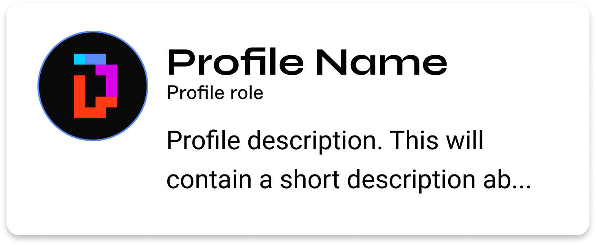

# HSProfile Component
Profiles show information about someone. May it be the user's, a fellow user's, or a person from the team.



## Usage
### HTML
```html
<div class="hs-profile">
    <div class="hs-profile__img">
        
    </div>
    <div class="hs-profile__info">
        <h3 class="hs-profile__name">Name of person</h3>
        <p class="hs-profile__role">Role of person</p>
        <p class="hs-profile__description">Lorem ipsum dolor sit amet, consectetur adipisicing elit. Adipisci, quas.</p>
    </div>
</div>
```

### SCSS/CSS
```scss
@use 'node_modules/@devprotocol/hashi';
@use 'node_modules/@devprotocol/hashi/hs-profile';

@include hashi.init {
  @include hs-profile.render();
}
```

### Outlined Profile
The outlined profile style is the default profile style.
```html
<div class="hs-profile">
    <div class="hs-profile__img">
        
    </div>
    <div class="hs-profile__info">
        <h3 class="hs-profile__name">Name of person</h3>
        <p class="hs-profile__role">Role of person</p>
        <p class="hs-profile__description">Lorem ipsum dolor sit amet, consectetur adipisicing elit. Adipisci, quas.</p>
    </div>
</div>
```

### Filled Profile
The filled profile style is a style variant of the profile component. To enable this style, attach the `.is-filled` class to the parent element's class list.

> The class names inside brackets are only for emphasis, not to be used in the actual implementation.

```html
<div class="hs-profile [is-filled]">
    <div class="hs-profile__img">
        
    </div>
    <div class="hs-profile__info">
        <h3 class="hs-profile__name">Name of person</h3>
        <p class="hs-profile__role">Role of person</p>
        <p class="hs-profile__description">Lorem ipsum dolor sit amet, consectetur adipisicing elit. Adipisci, quas.</p>
    </div>
</div>
```

## API
### CSS Classes
These are used to extend and modify the styles of a component on the markup.

### Anatomical Classes
These classes make up the elements inside a component.

| Class                      | Effect                                               |
|----------------------------|------------------------------------------------------|
| `.hs-profile`              | Main profile component class.                        |
| `.hs-profile__img`         | The component's image class.                         |
| `.hs-profile__info`        | A wrapper class for the profile information.         |
| `.hs-profile__name`        | The name of the person in the profile.               |
| `.hs-profile__role`        | The role of the person in the profile.               |
| `.hs-profile__description` | A short description about the person in the profile. |

### Variant Classes
For information on how to use these classes, [click here](index.md#modification-html).

| Class        | Effect                                   |
|--------------|------------------------------------------|
| `.is-filled` | Renders the profile in its filled style. |


### Custom Properties
These are for creating your own component theme classes that you can append to the parent element markup.

| Property                                                   | Effect                                                       |
|------------------------------------------------------------|--------------------------------------------------------------|
| `--hs-profile-fill`                                        | Changes the profile's background color.                      |
| `--hs-profile-ink`                                         | Changes the profile's text color.                            |
| `--hs-profile-border`                                      | Changes the profile's border color.                          |
| `--hs-profile-radius`                                      | Changes the profile's border radius.                         |
| `--hs-profile-padding`                                     | Changes the profile's padding.                               |
| `--hs-profile-width`                                       | Changes the profile's width.                                 |
| `--hs-profile-gap`                                         | Changes the profile's gap.                                   |
| `--hs-profile-profile-img-size`                            | Changes the profile image's size.                            |
| `--hs-profile-profile-img-border`                          | Changes the profile image's border color.                    |
| `--hs-profile-profile-[name/description/role]-family`      | Changes the profile name, description, and role font family. |
| `--hs-profile-profile-[name/description/role]-size`        | Changes the profile name, description, and role font size.   |
| `--hs-profile-profile-[name/description/role]-weight`      | Changes the profile name, description, and role font weight. |
| `--hs-profile-profile-[name/description/role]-line-height` | Changes the profile name, description, and role line-height. |

#### Example
```scss
.my-profile-theme {
  --hs-profile-ink: lime;
}
```

### Configuring styles
Here are all the themeable properties for this component. The directions to use these properties are located in
the [render API](index.md#modification-scss).

```scss
$fill: 'surface' !default;
$ink: 'surface-ink' !default;
$border: $fill !default;
$tone: 300 !default;

$accent: 'native-blue' !default;
$accent-tone: 400 !default;

$radius: 'radius-sm' !default;
$padding: 'padding-md' !default;

$width: 100% !default;
$gap: 0.7rem !default;
$img-size: 70px !default;

$name-type-preset: 'h3' !default;
$description-type-preset: 'body' !default;
$role-type-preset: 'small' !default;

$elevation-level: 2 !default;
$has-elevation: true !default;
```

### Extending styles
If you wish to extend the component styles, the [`extend()` API](index.md#extension-scss) might come in handy.