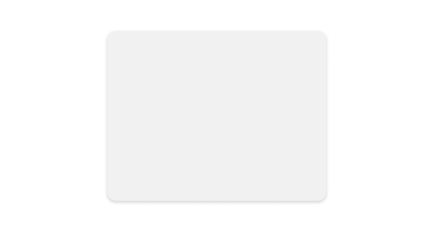
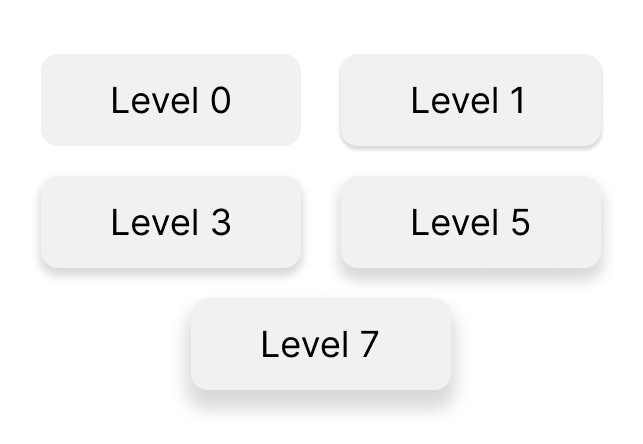

Surface is the area all elements operate on. Surfaces can be found in components, or in the back of pages.

## Behavior
The behavior of a surface is like how a three-dimensional object would operate in a space. It has size, and depth.

### Depth and Elevation
Depth is used whenever you want to distinguish a portion of the page from another portion. It indicated using elevation--a drop shadow behind the surface element, or color. We generally limit the depth to these numbers: 0, 1, 3, 5, and 7. The limitation is set in place as we don't want "too much shadow/color" in the designs. On elements interacting on the main page background, color is generally used as it is more subtle than shadows. An exception to this rule are cards. Bigger elements, use light drop shadows.

Here are the default immutable shadow specs.

| Property | Value |
|----------|-------|
| Color    | #000  |
| Opacity  | 15%   |

The y-offset, blur, and spread depends on the elevation level.

| Level       | Y Offset | Blur | Spread |
|-------------|----------|------|--------|
| 0 (none)    | 1px      | 0px  | 0px    |
| 1 (low)     | 3px      | 4px  | 1px    |
| 3 (default) | 6px      | 10px | 2px    |
| 5 (high)    | 10px     | 15px | 3px    |
| 7 (highest) | 15px     | 20px | 4px    |

#### When do I add depth to an element?
You add depth to an element if it overlaps 3 or more elements before it (excluding the background). Or if the element is generally a temporary overlapping element (like a modal, or a dialog).